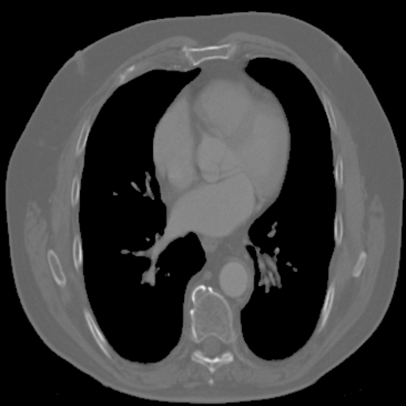

<h2>TensorFlow-FlexUNet-Image-Segmentation-Lung-CT (2025/08/12)</h2>

This is the first experiment of Image Segmentation for Lung-CT, 
 based on our 
 <a href="https://github.com/sarah-antillia/TensorFlow-FlexUNet-Image-Segmentation-Model">
<b>TensorFlowFlexUNet (TensorFlow Flexible UNet Image Segmentation Model for Multiclass)</b></a>
, and a 512x512 pixels 
<a href="https://drive.google.com/file/d/1AhVDIZx9D1TU56u5iaMW_mcreBOQgXlt/view?usp=sharing">
<b>Augmented-Lung-CT-ImageMask-Dataset.zip</b></a>.
which was derived by us from 
  
<a href="https://drive.google.com/file/d/1EjzpPq0GhpmlMoSUqnJIdukg_QQDJtgq/view?usp=drive_link">
LungSegDB,zip
</a>
in 
<a href="https://github.com/sadjadrz/Lung-segmentation-dataset">
<b>LungSegDB: Lung Segmentation Dataset</b>
</a>
 
 
As demonstrated in <a href="https://github.com/sarah-antillia/TensorFlow-FlexUNet-Image-Segmentation-STARE-Retinal-Vessel">
TensorFlow-FlexUNet-Image-Segmentation-STARE-Retinal-Vessel</a> ,
 our Multiclass TensorFlowFlexUNet, which uses categorized masks, can also be applied to 
single-class image segmentation models. 
This is because it inherently treats the background as one category and your single-class mask data as 
a second category. In essence, your single-class segmentation model will operate with two categorized classes within our Multiclass UNet framework.
 
 
<b>Acutual Image Segmentation for 512x512 Lung Infection images</b> 

As shown below, the inferred masks predicted by our segmentation model trained on the 
PNG dataset appear similar to the ground truth masks.
 
<table>
<tr>
<th>Input: image</th>
<th>Mask (ground_truth)</th>
<th>Prediction: inferred_mask</th>
</tr>
<tr>
<td></td>
<td></td>
<td></td>
</tr>
<tr>
<td></td>
<td></td>
<td></td>
</tr>
<tr>
<td></td>
<td></td>
<td></td>
</tr>
</table>

 
<h3>1. Dataset Citation</h3>
The image and mask dataset used here has been taken from the following dataset. 
<a href="https://drive.google.com/file/d/1EjzpPq0GhpmlMoSUqnJIdukg_QQDJtgq/view?usp=drive_link">
LungSegDB,zip
</a>
in 
<a href="https://github.com/sadjadrz/Lung-segmentation-dataset">
<b>LungSegDB: Lung Segmentation Dataset</b>
</a>
  
Automatic lung image segmentation assists doctors in identifying diseases such as lung cancer, COVID-19, 
and respiratory disorders. However, lung segmentation is challenging due to overlapping features like 
vascular and bronchial structures, along with pixellevel fusion of brightness, color, and texture. 
we introduce LungSegDB, a comprehensive dataset for lung segmentation. We followed a systematic workflow 
to prepare the datasets, which included downloading the datasets, creating lung masks using any labeling 
software, conducting an expert review for accurate validation, and finally evaluating the results of 
the annotation process.
 
 
Details on the dataset can be found at 
<a href="https://onlinelibrary.wiley.com/doi/10.1111/exsy.13625">
ABANet: Attention boundary-aware network for image segmentation.
</a>
 
<h3>
<a id="2">
2 Lung ImageMask Dataset
</a>
</h3>
 If you would like to train this Lung Segmentation model by yourself,
 please download the dataset from the google drive  
<a href="https://drive.google.com/file/d/1AhVDIZx9D1TU56u5iaMW_mcreBOQgXlt/view?usp=sharing">
Augmented-Lung-CT-ImageMask-Dataset.zip</a>.
 
, expand the downloaded ImageMaskDataset and put it under <b>./dataset</b> folder to be
<pre>
./dataset
└─Lung
    ├─test
    │   ├─images
    │   └─masks
    ├─train
    │   ├─images
    │   └─masks
    └─valid
        ├─images
        └─masks
</pre>
 
<b>Lung Statistics</b> 
 
 

On the derivation of the augmented dataset, please refer to the following Python scripts: 
<li><a href="./generator/ImageMaskDatasetGenerator.py">ImageMaskDatasetGenerator.py</a></li>
<li><a href="./generator/split_master.py">split_master.py</a></li>
 

As shown above, the number of images of train and valid datasets is large enough to use for a training set of our segmentation model.
 
 
<b>Train_images_sample</b> 

 
<b>Train_masks_sample</b> 

 
<h3>
3 Train TensorFlowFlexUNet Model
</h3>
 We trained Lung TensorFlowFlexUNet Model by using the following
<a href="./projects/TensorFlowFlexUNet/Lung/train_eval_infer.config"> <b>train_eval_infer.config</b></a> file.  
Please move to ./projects/TensorFlowFlexUNet/Lung and run the following bat file. 
<pre>
>1.train.bat
</pre>
, which simply runs the following command. 
<pre>
>python ../../../src/TensorFlowFlexUNetTrainer.py ./train_eval_infer.config
</pre>

<b>Model parameters</b> 
Defined a small <b>base_filters = 16 </b> and large <b>base_kernels = (9,9)</b> for the first Conv Layer of Encoder Block of 
<a href="./src/TensorFlowFlexUNet.py">TensorFlowFlexUNet.py</a> 
and a large num_layers (including a bridge between Encoder and Decoder Blocks).
<pre>
[model]
;You may specify your own UNet class derived from our TensorFlowFlexModel
model         = "TensorFlowFlexUNet"
generator     =  False
image_width    = 512
image_height   = 512
image_channels = 3
num_classes    = 2

base_filters   = 16
base_kernels   = (9,9)
num_layers     = 8
dropout_rate   = 0.04
dilation       = (1,1)
</pre>
<b>Learning rate</b> 
Defined a very small learning rate.  
<pre>
[model]
learning_rate  = 0.00007
</pre>
<b>Loss and metrics functions</b> 
Specified "categorical_crossentropy" and <a href="./src/dice_coef_multiclass.py">"dice_coef_multiclass"</a>. 
<pre>
[model]
loss           = "categorical_crossentropy"
metrics        = ["dice_coef_multiclass"]
</pre>
<b>Dataset class</b> 
Specifed <a href="./src/ImageCategorizedMaskDataset.py">ImageCategorizedMaskDataset</a> class. 
<pre>
[dataset]
class_name    = "ImageCategorizedMaskDataset"
</pre>
 
<b>Learning rate reducer callback</b> 
Enabled learing_rate_reducer callback, and a small reducer_patience.
<pre> 
[train]
learning_rate_reducer = True
reducer_factor     = 0.4
reducer_patience   = 4
</pre>
<b>Early stopping callback</b> 
Enabled early stopping callback with patience parameter.
<pre>
[train]
patience      = 10
</pre>

<b>RGB Color map</b> 
rgb color map dict for Lung 1+1 classes. 
<pre>
[mask]
mask_file_format = ".png"
; 1+1 classes
; categories  = ["lung"]
; RGB colors        lung;white     
rgb_map = {(0,0,0):0,(255,255,255):1,}
</pre>

<b>Epoch change inference callback</b> 
Enabled <a href="./src/EpochChangeInfereuncer.py">epoch_change_infer callback</a></b>. 
<pre>
[train]
epoch_change_infer       = True
epoch_change_infer_dir   =  "./epoch_change_infer"
num_infer_images         = 6
</pre>

By using this callback, on every epoch_change, the inference procedure can be called
 for 6 images in <b>mini_test</b> folder. This will help you confirm how the predicted mask changes 
 at each epoch during your training process.    

<b>Epoch_change_inference output at starting (epoch 1,2,3)</b> 
 
 
<b>Epoch_change_inference output at middlepoint (epoch 34,35,36)</b> 
 
 
<b>Epoch_change_inference output at ending (epoch 70,71,72)</b> 
 
 
In this experiment, the training process was terminated at epoch 72.  
 
 

<a href="./projects/TensorFlowFlexUNet/Lung/eval/train_metrics.csv">train_metrics.csv</a> 
 

 
<a href="./projects/TensorFlowFlexUNet/Lung/eval/train_losses.csv">train_losses.csv</a> 
 

 

<h3>
4 Evaluation
</h3>
Please move to <b>./projects/TensorFlowFlexUNet/Lung</b> folder, 
and run the following bat file to evaluate TensorFlowFlexUNet model for Lung. 
<pre>
./2.evaluate.bat
</pre>
This bat file simply runs the following command.
<pre>
python ../../../src/TensorFlowFlexUNetEvaluator.py ./train_eval_infer_aug.config
</pre>

Evaluation console output: 

  

<a href="./projects/TensorFlowFlexUNet/Lung/evaluation.csv">evaluation.csv</a> 
The loss (categorical_crossentropy) to this Lung/test was very low and dice_coef_multiclass 
very high as shown below.
 
<pre>
categorical_crossentropy,0.0138
dice_coef_multiclass,0.9933
</pre>
 

<h3>
5 Inference
</h3>
Please move <b>./projects/TensorFlowFlexUNet/Lung</b> folder 
,and run the following bat file to infer segmentation regions for images by the Trained-TensorFlowFlexUNet model for Lung. 
<pre>
./3.infer.bat
</pre>
This simply runs the following command.
<pre>
python ../../../src/TensorFlowFlexUNetInferencer.py ./train_eval_infer_aug.config
</pre>

<b>mini_test_images</b> 
 
<b>mini_test_mask(ground_truth)</b> 
 

<b>Inferred test masks</b> 
 
 

<b>Enlarged images and masks of 512x512 pixels</b> 
<table>
<tr>
<th>Image</th>
<th>Mask (ground_truth)</th>
<th>Inferred-mask</th>
</tr>

<tr>
<td></td>
<td></td>
<td></td>
</tr>

<tr>
<td></td>
<td></td>
<td></td>
</tr>

<tr>
<td></td>
<td></td>
<td></td>
</tr>

<tr>
<td></td>
<td></td>
<td></td>
</tr>

<tr>
<td></td>
<td></td>
<td></td>
</tr>

<tr>
<td></td>
<td></td>
<td></td>
</tr>
</table>

 
<h3>
References
</h3>
<b>1. Radiological Lung Segmentation: A Radiopaedia-Based Overview</b> 
<a href="https://homehealthup.com/lung-segmentation-radiology/">
https://homehealthup.com/lung-segmentation-radiology/
</a>
 
 

<b>2. ABANet: Attention boundary-aware network for image segmentation</b> 
Sadjad Rezvani, Mansoor Fateh, Hossein Khosravi 
<a href="https://onlinelibrary.wiley.com/doi/10.1111/exsy.13625">
https://onlinelibrary.wiley.com/doi/10.1111/exsy.13625
</a>
 
 

